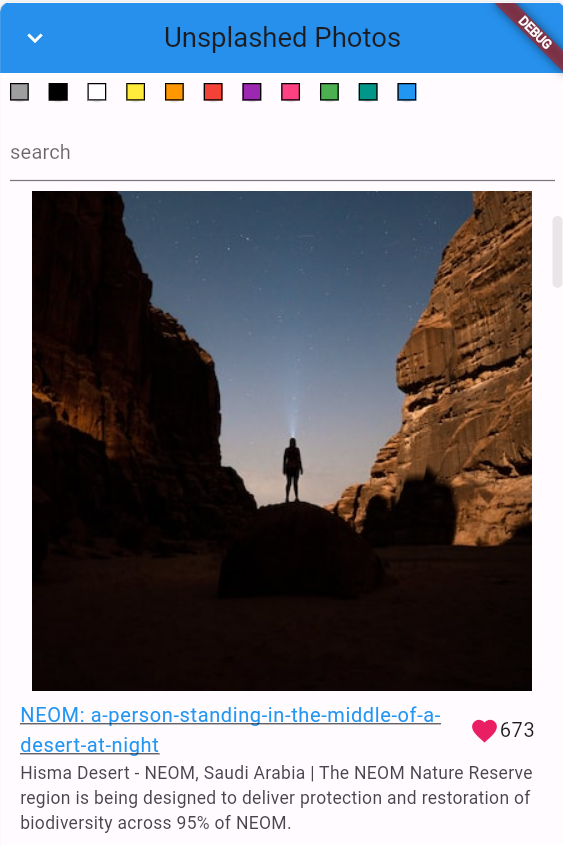

# Unsplash Image Gallery App

## Overview

This Flutter app leverages the Unsplash API to create an infinitely scrollable list of images. 
provides details such as artist, title, and description for each image. 
Additionally, the app supports searching images by title and color.

## Features

- Infinite Scroll: Explore a vast collection of Unsplash images with endless scrolling.
- Image Details: View artist information, title, and description for each image.
- Search Functionality: Easily find images by title.
- Color Search: Search images by color to discover a visually cohesive collection.

